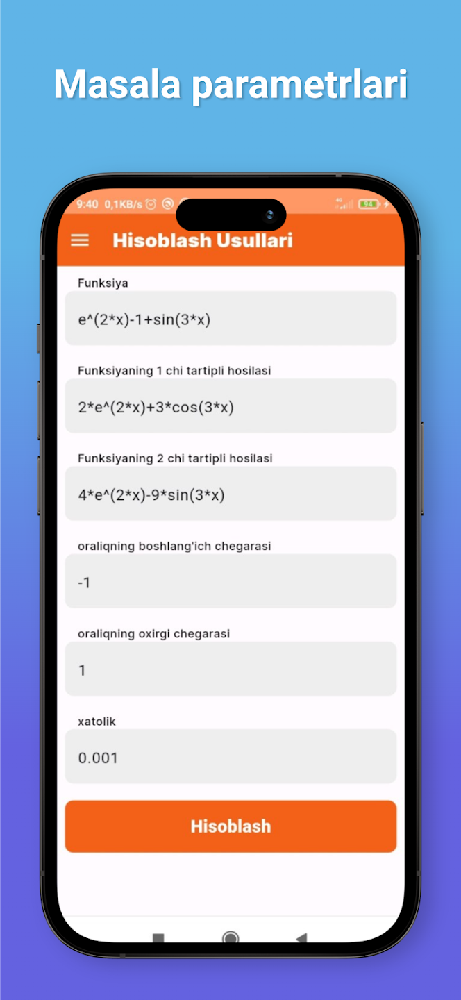

<p float="left">
  
  
</p>

# Hisoblash Usullari

"Hisoblash Usullari" is an application for [for solve the equations].

## Features

- **Solve equation** - Solve equation by calculation methods. With the four methods below

## Installation

To clone this repository, use the following command:

```bash
git clone https://github.com/ZikrullaYashinov/hisoblash_usullari
```

# Hisoblash Usullari

"Hisoblash Usullari" - bu ilova [tenglamalarni yechish uchun].

## Xususiyatlar

- **Tenglamalarni yechish** - Tenglamalarni hisoblash usullari bilan yechadi. Quyidagi to'rt xil usul bilan

## O'rnatish

Loyihani klonlab olish uchun quyidagi buyruqdan foydalaning:

```bash
git clone https://github.com/ZikrullaYashinov/hisoblash_usullari
```
